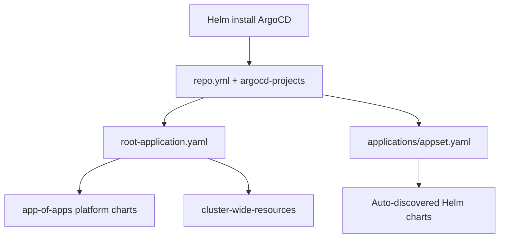

# HomeProd-K3s

A home lab Kubernetes environment implementing production-grade infrastructure practices with K3s, GitOps, and comprehensive monitoring.


## Overview

This project implements a home lab Kubernetes environment using K3s (lightweight Kubernetes) with 1 master and 3 worker nodes. It leverages GitOps principles with ArgoCD for deployment and configuration management, and includes a comprehensive monitoring stack.

This is an actively maintained project that will continue to evolve with new features, improvements, and best practices over time.

## Architecture

- **K3s Cluster**: Lightweight Kubernetes with 1 master and 3 worker nodes
- **GitOps**: ArgoCD for declarative, Git-based application deployment
- **App of Apps Pattern**: Hierarchical management of platform infrastructure
- **ApplicationSet**: Automatic discovery and deployment of Helm charts under `applications/`
- **Monitoring**: Grafana, Prometheus, Loki, Promtail, and Uptime Kuma
- **Certificate Management**: Let's Encrypt certificates with cert-manager
- **Domain Management**: AWS Route53 with external-dns for automatic DNS record creation
- **Authentication**: SSO integration with Azure AD (ArgoCD, Grafana, SecretPass)
- **Secrets Management**: AWS Secrets Manager integration via external-secrets operator
- **Ingress**: Traefik as the ingress controller
- **Networking**: Cilium as the CNI
- **Load Balancing**: MetalLB for bare metal load balancing with dedicated IP pools
- **Auto-reload**: Stakater Reloader for ConfigMap and Secret changes

## Repository Structure

```
homeProd-K3s/
├── argocd/                          # ArgoCD Helm install (values, SSO secret)
├── argocd-projects/                 # ArgoCD AppProjects (RBAC separation)
├── app-of-apps/                     # Platform infrastructure (App of Apps)
│   ├── root-application.yaml        # Root ArgoCD Application entry point
│   ├── repo.yml                     # Git repository secret for ArgoCD
│   └── chart-*/                     # One folder per platform Helm chart
├── applications/                    # Application Helm charts (ApplicationSet)
│   ├── appset.yaml                  # ApplicationSet — auto-discovers Chart.yaml files
│   ├── appservices/                 # User-facing applications
│   │   ├── secretpass/              # Password manager (client, server, db)
│   │   └── blackjack/               # Sample app with ingress, HPA, metrics
│   ├── platform-infra/              # Cluster-wide certs, secrets, MetalLB pools
│   └── cronjob-services/            # Scheduled network device backups
├── k8s-apps/
│   └── cluster-wide-resources/      # ClusterIssuer & ClusterSecretStore
└── .github/
    ├── workflows/argocd.yml         # CI: auto-upgrade ArgoCD on main
    └── PULL_REQUEST_TEMPLATE.md
```

## GitOps Deployment Model

ArgoCD manages the cluster through three layers:



| Layer | Entry point | What it deploys |
|-------|-------------|-----------------|
| Bootstrap | `helm install` + `argocd/values.yaml` | ArgoCD itself |
| App of Apps | `app-of-apps/root-application.yaml` | Platform charts (Traefik, Prometheus, etc.) |
| ApplicationSet | `applications/appset.yaml` | All Helm charts under `applications/**/` |
| Standalone | `k8s-apps/cluster-wide-resources/Cluster-wide-application.yml` | ClusterIssuer, ClusterSecretStore |
| Projects | `argocd-projects/root-projects-app.yaml` | ArgoCD AppProject RBAC |

The ApplicationSet uses Go templates to discover every `Chart.yaml` under `applications/**/`. For a chart at `applications/<project>/<namespace-or-app>/<chart>/`:

- **ArgoCD project** = 2nd path segment (`appservices`, `platform-infra`, `cronjob-services`)
- **Destination namespace** = 3rd path segment (`secretpass`, `blackjack`, `cronjob`, `pool-alb`, etc.)

## Platform Infrastructure (App of Apps)

Charts in `app-of-apps/` are deployed via the root application. Most use a multi-source pattern: values from this Git repo + chart from an upstream Helm repository.

| Chart | ArgoCD Project | Namespace | Purpose |
|-------|---------------|-----------|---------|
| cert-manager | default | `cert-manager` | TLS certificate automation |
| cilium | default | `cilium-network-policy` | CNI and network policies |
| external-dns | default | `external-dns` | Route53 DNS record automation |
| external-secrets | default | `external-secrets` | AWS Secrets Manager sync operator |
| grafana | monitoring | `monitoring` | Metrics dashboards |
| keel | default | `keel` | Automatic container image updates |
| loki | monitoring | `monitoring` | Log aggregation |
| metallb | default | `service-load-balancer` | Bare-metal load balancing |
| metrics-server | default | `metrics-server` | Resource metrics for HPA |
| prometheus | monitoring | `monitoring` | Metrics collection |
| promtail | monitoring | `monitoring` | Log shipping to Loki |
| reloader | default | `reloader` | Reload pods on ConfigMap/Secret change |
| traefik | default | `traefik-ingress-controller` | Ingress controller |
| uptime-kuma | monitoring | `monitoring` | Uptime monitoring |

## ArgoCD Projects

Defined in `argocd-projects/` and deployed via `argocd-projects/root-projects-app.yaml`:

| Project | Applications |
|---------|-------------|
| `monitoring` | grafana, prometheus, loki, promtail, uptime-kuma |
| `appservices` | secretpass-client, secretpass-server, secretpass-db, blackjack |
| `platform-infra` | certificates-management, pool-alb, secrets-management |
| `cronjob-services` | cronjob |
| `default` | All `app-of-apps` platform charts, cluster-wide-resources |

### ArgoCD SSO & RBAC

Configured in `argocd/values.yaml`:

- **Domain**: `argocd-k3s.spider-shlomo.com`
- **SSO**: Azure AD SAML via Dex (`argocd/secret-sso.yml` — not committed to Git)
- **RBAC roles**: `admin`, `readonly-monitoring`, `readonly-appservices`
- **Ingress**: Traefik with TLS via `argocd-tls` secret

## Network & Load Balancing

MetalLB IP pools are defined in `applications/platform-infra/pool-alb/values.yaml`:

| Pool | Addresses | Auto-assign | Purpose |
|------|-----------|-------------|---------|
| `traefikip` | `10.90.100.121/32` | No | Traefik ingress #1 |
| `traefikip2` | `10.90.100.126/32` | No | Traefik ingress #2 |
| `traefikip3` | `10.90.100.128/32` | No | Traefik ingress #3 |
| `alb-resources` | `10.90.100.130-10.90.100.150` | Yes | General LoadBalancer services |

All pools are advertised via L2. Traefik receives dedicated static IPs; other services draw from the `alb-resources` range.

## Monitoring Stack

| Component | Namespace | Ingress host |
|-----------|-----------|-------------|
| Grafana | `monitoring` | `grafana-k3s.spider-shlomo.com` |
| Prometheus | `monitoring` | `prometheus-k3s.spider-shlomo.com` |
| Loki | `monitoring` | — |
| Promtail | `monitoring` | — |
| Uptime Kuma | `monitoring` | `uptime-kuma-k3s.spider-shlomo.com` |
| Pushgateway | `monitoring` | `pushgateway.spider-shlomo.com` |

Credentials for Grafana, Loki, and metrics auth are synced via `applications/platform-infra/secrets-management/`.

### Cursor + Grafana MCP

You can connect **Cursor** to Grafana via **MCP** (`uvx mcp-grafana`) to create dashboards, run PromQL/LogQL, and manage folders from the IDE — without deploying a separate `grafana-mcp` Helm chart.

See **[explain-mcp-grafana.md](explain-mcp-grafana.md)** for a full guide in **English and Hebrew** (how `uvx` works, `mcp.json` setup, troubleshooting).

## Cluster-Wide Resources

### ClusterIssuer (`k8s-apps/cluster-wide-resources/ClusterIssuer.yaml`)

- Name: `letsencrypt-dns-issuer`
- ACME DNS-01 solver via AWS Route53 (`us-east-1`)
- Credentials from Kubernetes secret `aws-secret` (not committed to Git)

### ClusterSecretStore (`k8s-apps/cluster-wide-resources/ClusterSecretStore.yaml`)

- Name: `aws-secret-store`
- Provider: AWS Secrets Manager (`us-east-1`)
- Auth via `aws-secret` in the `external-secrets` namespace

### Certificates Management (`applications/platform-infra/certificates-management/`)

Per-application TLS certificates issued by cert-manager:

| Certificate | Namespace | Host |
|-------------|-----------|------|
| argocd-cert | `argocd` | `argocd-k3s.spider-shlomo.com` |
| grafana-cert | `monitoring` | `grafana-k3s.spider-shlomo.com` |
| prometheus-cert | `monitoring` | `prometheus-k3s.spider-shlomo.com` |
| uptime-kuma-cert | `monitoring` | `uptime-kuma-k3s.spider-shlomo.com` |
| prometheus-pushgateway-cert | `monitoring` | `pushgateway.spider-shlomo.com` |
| blackjack-cert | `blackjack` | `blackjack-k3s.spider-shlomo.com` |
| secretpass-cert | `secretpass` | `secretpass.spider-shlomo.com` |
| secretpass-cert-backend | `secretpass` | `secretpass-backend.spider-shlomo.com` |
| traefik-ui-cert | `traefik-ingress-controller` | `traefik.spider-shlomo.com` |
| cilium-ui-cert | `cilium-network-policy` | `cilium-ui.spider-shlomo.com` |

### Secrets Management (`applications/platform-infra/secrets-management/`)

ExternalSecrets synced from AWS Secrets Manager:

| ExternalSecret | Namespace | AWS key | Target secret |
|----------------|-----------|---------|---------------|
| secretspass-credentials | `secretpass` | `secretspass-credentials` | `secretspass-credentials` |
| external-dns-secrets | `external-dns` | `route53-access` | `aws-secret` |
| cert-manager-secrets | `cert-manager` | `route53-access` | `aws-secret` |
| cronjob-fortigate | `cronjob` | `BUCKET-CRONJOB` | `cronjob-credentials-fortigate-backup` |
| cronjob-juniper | `cronjob` | `juniper-credentials` | `cronjob-credentials-juniper-backup` |
| loki-credentials | `monitoring` | `keys` | `aws-secret` |
| grafana-credentials | `monitoring` | `secrets-grafana` | `aws-secret-grafana` |
| grafana-secret-sso | `monitoring` | `secret-sso` | `aws-secret-grafana-sso` |
| secretpass-metrics-auth | `monitoring` | `secretpass-metrics-auth` | `aws-secret-secretpass-metrics-auth` |
| kuma-uptime-metrics-auth | `monitoring` | `kuma-uptime-metrics-auth` | `kuma-uptime-metrics-auth` |

## Applications (ApplicationSet)

All charts under `applications/` are auto-deployed by `applications/appset.yaml`:

| Category | Chart | ArgoCD Project | Namespace |
|----------|-------|---------------|-----------|
| appservices | secretpass-client | `appservices` | `secretpass` |
| appservices | secretpass-server | `appservices` | `secretpass` |
| appservices | secretpass-db | `appservices` | `secretpass` |
| appservices | blackjack | `appservices` | `blackjack` |
| platform-infra | certificates-management | `platform-infra` | `certificates-management` |
| platform-infra | pool-alb | `platform-infra` | `pool-alb` |
| platform-infra | secrets-management | `platform-infra` | `secrets-management` |
| cronjob-services | cronjob | `cronjob-services` | `cronjob` |

### SecretPass — Password Manager

Self-hosted password manager at `applications/appservices/secretpass/`:

| Chart | Component | Port | Image |
|-------|-----------|------|-------|
| `secretpass-client` | React frontend | 3000 | `shlomobarzili/secretpass-frontend:v3.1.0` |
| `secretpass-server` | Backend API + SAML | 5050 | `shlomobarzili/secretpass-backend:v5.1.0` |
| `secretpass-db` | MongoDB | 27017 | `mongo:latest` |

- **Host**: `secretpass.spider-shlomo.com`
- **Ingress paths**: `/` (frontend), `/api/` and `/remote/saml/` (backend)
- **TLS**: `secretpass-app-tls` (frontend), `secretpass-app-tls-backend` (backend)
- **Storage**: MongoDB PVC (`local-path`, 1Gi)
- **HPA**: Enabled on client and server (2–3 replicas)
- **SSO**: Microsoft Entra ID SAML — allowed users/orgs configured in server ConfigMap
- **Secrets**: `secretspass-credentials` from AWS Secrets Manager (JWT, MongoDB, Fernet key, admin password, SAML certs, AWS backup keys)
- **Reloader**: ConfigMaps and secrets auto-reloaded on change

### Blackjack — Sample Application

Sample app at `applications/appservices/blackjack/`:

- **Host**: `blackjack-k3s.spider-shlomo.com`
- **Image**: `shlomobarzili/blackjack:v1.0.0`
- **Features**: Ingress with TLS, HPA (2–3 replicas), `/metrics` endpoint
- **TLS**: `blackjack-tls` via certificates-management

### Cronjob — Network Device Backups

Scheduled backups at `applications/cronjob-services/cronjob/`:

| CronJob | Device | Schedule | Image |
|---------|--------|----------|-------|
| `backup-fortigate` | FortiGate firewall | `30 0 1 * *` (1st of month, 00:30) | `shlomobarzili/fortigate:v1.7.0` |
| `backup-juniper` | Juniper switch | `0 0 1 * *` (1st of month, 00:00) | `shlomobarzili/junipersw:v1.7.0` |

Each job:

1. Connects to the device via SSH
2. Stores backup on a PVC (`local-path`, 300Mi)
3. Uploads to AWS S3 (Azure/GCP optional)
4. Pushes metrics to Prometheus Pushgateway

ConfigMaps and secrets are auto-reloaded via Stakater Reloader. To add a new device, add a block in `cronjob/values.yaml` and a matching ExternalSecret in `secrets-management/values.yaml`.

## CI/CD

| Mechanism | Trigger | Action |
|-----------|---------|--------|
| GitHub Actions (`.github/workflows/argocd.yml`) | Push to `main` changing `argocd/**` | Upgrades ArgoCD via Helm on self-hosted runner |
| Keel | Container registry image tag change | Auto-updates deployments |
| ArgoCD sync | Git push to repo | Auto-syncs all applications (`selfHeal` + `prune`) |

## Sensitive Files (Not in Git)

The following files are listed in `.gitignore` and must be created locally:

| File | Purpose |
|------|---------|
| `argocd/secret-sso.yml` | Azure AD SAML certificate for ArgoCD Dex |
| `k8s-apps/cluster-wide-resources/secret.yml` | AWS credentials for ClusterIssuer and ClusterSecretStore |
| `app-of-apps/chart-cert-manager/secrets.yaml` | cert-manager Route53 credentials |
| `app-of-apps/chart-external-secrets/secrets.yaml` | external-secrets operator AWS credentials |
| `node3-taint.yaml` | Local node taint configuration |

## Prerequisites

- K3s cluster with at least 1 master and 1 worker node (this project uses 1 master and 3 worker nodes)
- Sufficient system resources on nodes to run the monitoring stack and applications
- `kubectl` configured to access your cluster
- Git repository for storing configuration
- AWS account for Route53 and AWS Secrets Manager
- Azure AD account (for SSO configuration)
- GitHub account with repository access
- `kubectl` and `helm` installed locally
- AWS CLI configured

## Getting Started

<details><summary>Click to expand deployment instructions</summary>

### 1. Install ArgoCD

```bash
helm repo add argo https://argoproj.github.io/argo-helm
helm repo update

helm install prod-argocd argo/argo-cd \
  --namespace argocd \
  --create-namespace \
  --version 9.2.4 \
  --values argocd/values.yaml
```

> Configure Azure AD SSO in `argocd/secret-sso.yml` before installing (file is not committed to Git).

Get the admin password:

```bash
kubectl -n argocd get secret argocd-initial-admin-secret \
  -o jsonpath="{.data.password}" | base64 -d
```

Access the UI:

```bash
kubectl port-forward svc/prod-argocd-server -n argocd 8080:443
# Visit https://localhost:8080
```

### 2. Register Git Repository

```bash
kubectl apply -f app-of-apps/repo.yml
```

Update the repo URL in `repo.yml` if using a fork.

### 3. Deploy ArgoCD Projects

```bash
kubectl apply -f argocd-projects/root-projects-app.yaml
```

### 4. Deploy Platform Infrastructure (App of Apps)

```bash
kubectl apply -f app-of-apps/root-application.yaml
```

This deploys all charts under `app-of-apps/`. Remove or disable individual `*-application.yml` files if you don't need every component.

### 5. Deploy Cluster-Wide Resources

Create `k8s-apps/cluster-wide-resources/secret.yml` locally with AWS credentials, then:

```bash
kubectl apply -f k8s-apps/cluster-wide-resources/Cluster-wide-application.yml
```

### 6. Deploy ApplicationSet

```bash
kubectl apply -f applications/appset.yaml
```

This auto-deploys all Helm charts under `applications/` (SecretPass, Blackjack, certificates-management, pool-alb, secrets-management, cronjob).

### 7. Configure Before First Sync

Before applications sync successfully, ensure:

1. **AWS Secrets Manager** contains all keys referenced in `secrets-management/values.yaml`
2. **MetalLB IP ranges** in `pool-alb/values.yaml` match your network
3. **Hostnames** in application `values.yaml` files point to your domain
4. **Prometheus Pushgateway** is running (required for cronjob backup metrics)

</details>

## Adding New Applications

1. Create a Helm chart with `Chart.yaml` and `values.yaml` under:
   - `applications/appservices/<app>/` — user-facing apps
   - `applications/platform-infra/<chart>/` — cluster-wide resources
   - `applications/cronjob-services/<chart>/` — scheduled jobs
2. Add matching ExternalSecrets in `secrets-management/values.yaml` if secrets are needed
3. Add TLS certificates in `certificates-management/values.yaml` if ingress TLS is needed
4. Commit and push — the ApplicationSet discovers and deploys the new chart automatically

## Certificate Renewal

Certificates are automatically renewed by cert-manager before expiration.

## Monitoring Updates

1. Update chart version or values in the relevant `app-of-apps/chart-*/` directory
2. Commit and push to Git
3. ArgoCD syncs the changes automatically

## CI/CD for ArgoCD

Pushes to `main` that modify `argocd/**` trigger `.github/workflows/argocd.yml` on a self-hosted runner, which runs `helm upgrade prod-argocd` with version `9.2.4`.
